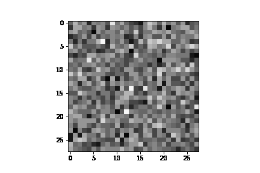
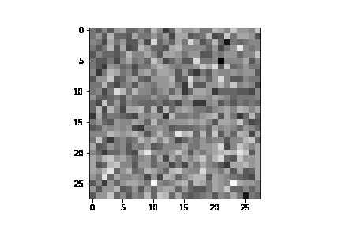

# Structured Denoising Diffusion Models in Discrete State-Spaces

## Getting Started

See [annotated_diffusion.ipynb](./annotated_diffusion.ipynb) for a walkthrough about the forward diffusion process.

See [annotated_traning.ipynb](./annotated_training.ipynb) for a detailed guide to train a model and generate samples from the model.

Training with `fashion_mnist` with 20 epochs, here are a few example GIFs of the image generation process:

  
  
  

Read Papers to learn more:
> [Structured Denoising Diffusion Models in Discrete State-Spaces
](https://arxiv.org/abs/2107.03006)

> [Understanding Diffusion Models: A Unified Perspective
](https://arxiv.org/abs/2208.11970)

## Variational Autoencoder (VAE)

### Parameters

- Joint distribution: $p(x,z)$

- Posterior: $q_\phi(z|x)$

### Evidence Lower Bound

$$
\begin{align*}
\log p(x) 
    &\geq \mathbb{E}_{q_\phi(z|x)}[\log \frac{p(x,z)}{q_\phi(z|x)}] \\
    &= \mathbb{E}_{q_\phi(z|x)}[\log p_\theta(x|z)] - D_{KL}(q_\phi(z|x) \ || \ p(z))
\end{align*}
$$

- $\mathbb{E}_{q_\phi(z|x)}[\log p_\theta(x|z)]$ measures the reconstruction likelihood of the decoder from the variational distribution. (Monte Carlo estimate)

- $D_{KL}(q_\phi(z|x) \ || \ p(z))$ measures how similar the learned variational distribution is to a prior belief held over latent variables. (Analytical calculation)

### Objective

$$
\begin{align*}
\argmax_{\phi,\theta} \mathbb{E}_{q_\phi(z|x)}[\log p_\theta(x|z)] - D_{KL}(q_\phi(z|x) \ || \ p(z)) \\
\approx \argmax_{\phi,\theta} \sum^L_{l=1}[\log p_\theta(x|z^{(l)})] - D_{KL}(q_\phi(z|x) \ || \ p(z))
\end{align*}
$$

where latents $\{ z^{(l)} \}^L_{l=1}$ are sampled from $q_\phi(z|x)$.

## Hierarchical Variational Autoencoder (HVAE)

Stacking VAEs on top of each other.

### Parameters

- Joint distribution: $p(x,z_{1:T}) = p(z_T)p_\theta(x|z_1)\prod^T_{t=2}p_\theta(z_{t-1}|z_t)$

- Posterior: $q_\phi(z|x) = q_\theta(z_1|x)\prod^T_{t=2}q_\theta(z_t|z_{t-1})$

### Evidence Lower Bound

$$
\begin{align*}
\log p(x) 
    &\geq \mathbb{E}_{q_\phi(z_{1:T}|x)}[\log \frac{p(x,z_{1:T})}{q_\phi(z_{1:T}|x)}] \\
    &= \mathbb{E}_{q_\phi(z_{1:T}|x)}[\log \frac{p(z_T)p_\theta(x|z_1)\prod^T_{t=2}p_\theta(z_{t-1}|z_t)}{q_\theta(z_1|x)\prod^T_{t=2}q_\theta(z_t|z_{t-1})}]
\end{align*}
$$

### Objective

Similar to VAE.

## Variational Diffusion Models (VDM)

HVAE but with three key restrictions:

- The latent dimension is exactly equal to the data dimension 
$\implies q_\phi(z_{1:T}|x)= q(z_{1:T}|x_0) = \prod^T_{t=1}q(x_t|x_{t-1})$

- The structure of the latent encoder at each timestep is not learned; it is pre-defined as a linear Gaussian model
$\implies$ The latent encoder is a Gaussian distribution centered around the output of the previous timestep $\implies q(x_t|x_{t-1}) = \mathcal{N}(x_t;\sqrt{\alpha_t}x_{t-1}, (1-\alpha_t)\bold{I})$

- The Gaussian parameters of the latent encoders vary over time in such a way that the distribution of the latent at final timestep T is a standard Gaussian $\implies p(x_T)=\mathcal{N}(x_T;0,\bold{I})$, which is pure noise

### Parameters

- Joint distribution: $p(x_{0:T})$

- Posterior: $q(z_{1:T}|x_0) = \prod^T_{t=1}q(x_t|x_{t-1})$

### Evidence Lower Bound

$$
\begin{align*}
\log p(x) 
    \geq \mathbb{E}_{q(x_1|x_0)}[\log p_\theta(x_0|x_1)]
 - D_{KL}(q(x_T|x_0) \ || \ p(x_T)) \\
- \sum^T_{t=2} \mathbb{E}_{q(x_t|x_0)}[D_{KL}(q(x_{t-1}|x_t,x_0) \ || \ p_\theta(x_{t-1}|x_t))]
\end{align*}
$$

- $\mathbb{E}_{q(x_1|x_0)}[\log p_\theta(x_0|x_1)]$ measures the reconstruction likelihood of the decoder from the variational distribution. (Monte Carlo estimate)

- $D_{KL}(q(x_T|x_0) \ || \ p(x_T))$ measures how close the distribution of the final nosisified input is to the standard Gaussian prior.
> Note that it has no trainable parameters, and is also equal to zero under the assumptions.

- $\sum^T_{t=2} \mathbb{E}_{q(x_t|x_0)}[D_{KL}(q(x_{t-1}|x_t,x_0) \ || \ p_\theta(x_{t-1}|x_t))]$ is a *denoising matching term*. We learn desired denoising transition step $p_\theta(x_{t-1}|x_t)$ as an approximation to tracable, ground-truth denoising transition step $q(x_{t-1}|x_t, x_0)$.
> Note that when $T=1$, VDM's ELBO falls back into VAE's.

> Note that the *denoising matching term* dominates the overall optimization cost because of the summation term.

### Objective
For learning a neural network to predict the original ground truth image from an arbitrarily noisified version of it, minimize the summation term of the derived ELBO objective across all noise levels, which can be approximated by minimizing the expectation over all timesteps:

$$
\argmin_\theta \mathbb{E}_{t \sim U{2,T}}[\mathbb{E}_{q(x_t|x_0)}D_{KL}(q(x_{t-1}|x_t,x_0) \ || \ p_\theta(x_{t-1}|x_t))]
$$

which can be optimized using stochastic samples over timesteps.

For generating a novel $x_0$, sample Gaussian noise from $p(x_T) and iteratively running the denoising transitions $p_\theta(x_{t-1} | x_t)$ for T steps.